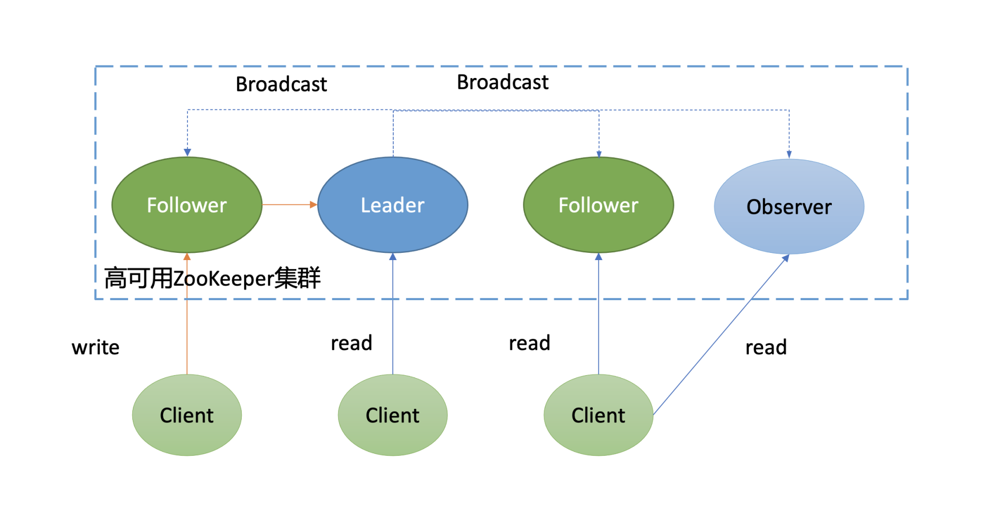

## Go Actor

> *Don’t communicate by sharing memory; share memory by communicating — Rob Pike*

Go是基于**Communicating Sequential Processes principle** (CSP)开发的语言


设计原则：

+ 轻启动
  + 遵照Go的简单设计原则
  + 因为无状态，运行时内存控制在百兆量级
  + 思考微服务的理念,状态计算由外部服务管理
+ 自注册
  + 直接使用Kafka的Consume Group实现
  + 服务发现、容错
+ 无状态
  + 通过redis、RPC等方式调用外部统一存储或服务来管理状态。包括分组计算、聚集计算和滑窗处理等状态数据存储和应用。
+ 扩展性
  + 使用脚本语言做项目定制开发
+ 多边兼容
  + 兼容云平台、本地化部署*（私有云）、边缘网关计算服务
+ 高级
  + 租户资源隔离[Optional]


数据源：Kafka

数据处理：ET


技术选型

+ Go内部Channel机制
  + Channel
+ Go Actor
  + 主从架构设计，m\*Master+ n\*Slavers。Master负责作为Source源读取Kafka中的数据，Master的副本数不超过Kafka中对应topic的分片数量。[学习Flink的实现思路]
  + 
+ Flink-Statefun Go-SDK
  + 基于Flink框架的状态函数。Serverless方案（FaaS）
  + 


服务发现

Consul /ETCD / Zookeeper对比

【REF：https://boilingfrog.github.io/2021/09/16/etcd%E5%AF%B9%E6%AF%94consul%E5%92%8CzooKeeper/】

ETCD是一个分布式、可靠的key-value存储的分布式系统，用于存储分布式系统中的关键数据；当然，它不仅仅用于存储，还提供配置共享及服务发现；基于Go语言实现 。

etcd的特点

- 完全复制：集群中的每个节点都可以使用完整的存档
- 高可用性：Etcd可用于避免硬件的单点故障或网络问题
- 一致性：每次读取都会返回跨多主机的最新写入
- 简单：包括一个定义良好、面向用户的API（gRPC）
- 安全：实现了带有可选的客户端证书身份验证的自动化TLS
- 可靠：使用Raft算法实现了强一致、高可用的服务存储目录


Consul使用Gossip协议（流言协议）。Consul支持多数据中心，通过Prepared Query中的路由策略返回最佳的服务实例地址，实现跨数据中心的数据容灾。Consul提供了三种模式的请求：默认、强一致（Consistent）以及弱一致（Stale），根据是否需要确保所有Leader确认来实现不同等级的数据一致性要求。


Zookeeper是一个典型的分布式数据一致性解决方案，分布式应用程序可以基于 ZooKeeper 实现诸如数据发布/订阅、负载均衡、命名服务、分布式协调/通知、集群管理、Master 选举、分布式锁和分布式队列等功能。

Zookeeper使用ZAB（ZooKeeper Atomic Broadcast 原子广播） 协议

Zookeeper的特点有：

+ 顺序一致性。 从同一客户端发起的事务请求最终将会严格地按照顺序被应用到Zk中
+ 原子性：所有事务请求的操作是原子的。要么整个集群所有节点都成功应用某一事务，要么都没应用
+ 单一系统映像：无论客户端连接到哪个ZK节点，其看到的服务端数据模型都是一致的
+ 可靠性：一旦一次更改请求被应用，更改的结果就会被持久化，直到被下一次更改覆盖。



#### 选型对比

- 1、并发原语：etcd 和 ZooKeeper 并未提供原生的分布式锁、Leader 选举支持，只提供了核心的基本数据读写、并发控制 API，由应用上层去封装，consul 就简单多了，提供了原生的支持，通过简单点命令就能使用；
- 2、服务发现：etcd 和 ZooKeeper 并未提供原生的服务发现支持，Consul 在服务发现方面做了很多解放用户双手的工作，提供了服务发现的框架，帮助你的业务快速接入，并提供了 HTTP 和 DNS 两种获取服务方式；
- 3、健康检查：consul 的健康检查机制，是一种基于 client、Gossip 协议、分布式的健康检查机制，具备低延时、可扩展的特点。业务可通过 Consul 的健康检查机制，实现 HTTP 接口返回码、内存乃至磁盘空间的检测，相比 etcd、ZooKeeper 它们提供的健康检查机制和能力就非常有限了；

etcd 提供了 Lease 机制来实现活性检测。它是一种中心化的健康检查，依赖用户不断地发送心跳续租、更新 TTL

ZooKeeper 使用的是一种名为临时节点的状态来实现健康检查。当 client 与 ZooKeeper 节点连接断掉时，ZooKeeper 就会删除此临时节点的 key-value 数据。它比基于心跳机制更复杂，也给 client 带去了更多的复杂性，所有 client 必须维持与 ZooKeeper server 的活跃连接并保持存活。

- 4、watch 特性：相比于 etcd , Consul 存储引擎是基于Radix Tree实现的，因此它不支持范围查询和监听，只支持前缀查询和监听，而 etcd 都支持, ZooKeeper 的 Watch 特性有更多的局限性，它是个一次性触发器;
- 5、线性读。etcd 和 Consul 都支持线性读，而 ZooKeeper 并不具备。
- 6、权限机制比较。etcd 实现了 RBAC 的权限校验，而 ZooKeeper 和 Consul 实现的 ACL。
- 7、事务比较。etcd 和 Consul 都提供了简易的事务能力，支持对字段进行比较，而 ZooKeeper 只提供了版本号检查能力，功能较弱。
- 8、多数据中心。在多数据中心支持上，只有 Consul 是天然支持的，虽然它本身不支持数据自动跨数据中心同步，但是它提供的服务发现机制、Prepared Query功能，赋予了业务在一个可用区后端实例故障时，可将请求转发到最近的数据中心实例。而 etcd 和 ZooKeeper 并不支持。


Kubernetes CRD

https://kubernetes.io/zh-cn/docs/tasks/extend-kubernetes/custom-resources/custom-resource-definitions/

```yaml
apiVersion: apiextensions.k8s.io/v1
kind: CustomResourceDefinition
metadata:
  # 名字必需与下面的 spec 字段匹配，并且格式为 '<名称的复数形式>.<组名>'
  name: crontabs.stable.example.com
spec:
  # 组名称，用于 REST API: /apis/<组>/<版本>
  group: stable.example.com
  # 列举此 CustomResourceDefinition 所支持的版本
  versions:
    - name: v1
      # 每个版本都可以通过 served 标志来独立启用或禁止
      served: true
      # 其中一个且只有一个版本必需被标记为存储版本
      storage: true
      schema:
        openAPIV3Schema:
          type: object
          properties:
            spec:
              type: object
              properties:
                cronSpec:
                  type: string
                image:
                  type: string
                replicas:
                  type: integer
  # 可以是 Namespaced 或 Cluster
  scope: Namespaced
  names:
    # 名称的复数形式，用于 URL：/apis/<组>/<版本>/<名称的复数形式>
    plural: crontabs
    # 名称的单数形式，作为命令行使用时和显示时的别名
    singular: crontab
    # kind 通常是单数形式的驼峰命名（CamelCased）形式。你的资源清单会使用这一形式。
    kind: CronTab
    # shortNames 允许你在命令行使用较短的字符串来匹配资源
    shortNames:
    - ct
```

创建资源实例

```yaml
apiVersion: "stable.example.com/v1"
kind: CronTab
metadata:
  name: my-new-cron-object
spec:
  cronSpec: "* * * * */5"
  image: my-awesome-cron-image
```

查看创建的CRD资源

```sh
root@fastest:/home/fastest/tools# kubectl get ct
NAME                 AGE
my-new-cron-object   6s
```

