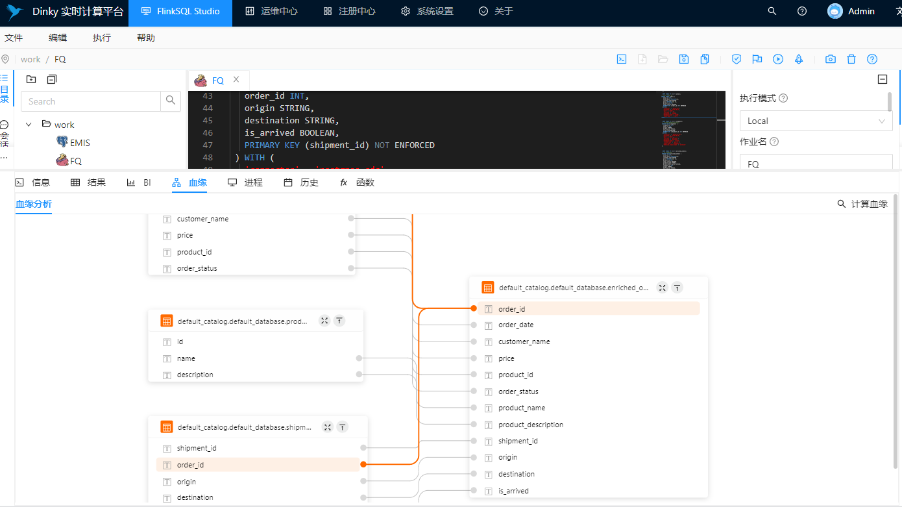
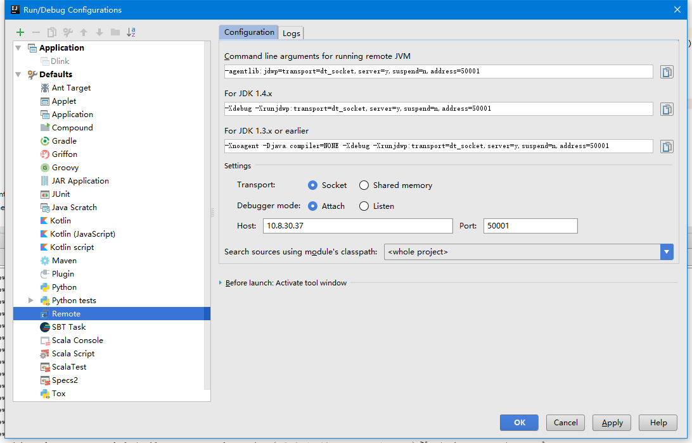

## DLink

**Dlink ** 是一款FlinkSQL交互式开发平台。Github:https://github.com/DataLinkDC/dlink.

`开箱即用` 、`易扩展` 的 `一站式` 实时计算平台，以 `Apache Flink` 为基础，连接 `OLAP` 和 `数据湖` 等众多框架，致力于 `流批一体` 和 `湖仓一体` 的建设与实践。

安装：https://github.com/DataLinkDC/dlink/blob/dev/docs/zh-CN/quick_start/deploy.md

环境版本记录：`2022.04.02`

| 测试机                           | 10.8.30.37 |
| -------------------------------- | ---------- |
| FLINK_HOME                       | 1.13.6     |
| HADOOP_HOME                      | 3.1.1      |
| doris                            | 0.15.0     |
| DLink                            | 0.6.0      |
| flink-sql-connector-postgres-cdc | 2.1.1      |
| flink-doris-connector            | 1.13       |
|                                  |            |

*测试器机：node37； dlink_home: /home/anxin/dlink-release-0.6.0*

> 用作我司数据中台平台，todo改造
>
> + 目前是flink on yarn的运行方式，需要支持k8s

 

## Dlink实操

### 安装运行

解压运行

> `sh auto.sh start`执行报错的话，执行
>
> java -Dloader.path=./lib,./plugins -Ddruid.mysql.usePingMethod=false -jar -Xms512M -Xmx2048M -XX:PermSize=512M -XX:MaxPermSize=1024M "./dlink-admin-0.6.0.jar"


Jar包准备：

> 1. Postgres数据库驱动postgresql-42.1.1.jar，安装到 $DLINK_HOME/lib
> 2. 插件包安装到 $DLINK_HOME/plugins 。具体参考 [附录](#附录)
> 3. 注意：flink-shaded-hadoop-3-uber.jar 需要将jar中javax/srvlet文件夹删除


### 运行截图

数据血缘：




### 远程调试

https://mp.weixin.qq.com/s/1MwJ6cJZmVWWzMk3z_ETKQ

启动命令中添加 

```sh
java -Dloader.path=./lib,./plugins -Ddruid.mysql.usePingMethod=false -Xdebug -Xrunjdwp:transport=dt_socket,server=y,suspend=n,address=50001 -jar -Xms512M -Xmx2048M -XX:PermSize=512M -XX:MaxPermSize=1024M "./dlink-admin-0.6.0.jar"
```


IDEA中设置



启动后即可在代码中进行debug：


## Doris

[Github](https://github.com/apache/incubator-doris)  [Offical](https://doris.apache.org/installing/compilation.html#developing-mirror-compilation-using-docker-recommended)

baidu开发（原名Palo），一个基于MPP支持交互式SQL查询的OLAP数据仓库。

+ 提供高并发低延迟的查询性能，同事有即席查询的高吞吐量
+ 提供批量加载和实时小批量数据加载
+ 提供高可用性、可靠性、容错和弹性伸缩

### 安装试用

下载源码 https://doris.apache.org/downloads/downloads.html

在ubuntu 20.04.3 LTS上执行 (`184 test`)

```sh
sudo apt install build-essential openjdk-8-jdk maven cmake byacc flex automake libtool-bin bison binutils-dev libiberty-dev zip unzip libncurses5-dev curl git ninja-build python
sudo add-apt-repository ppa:ubuntu-toolchain-r/ppa
sudo apt update
sudo apt install gcc-10 g++-10
sudo apt-get install autoconf automake libtool autopoint

# 设置JAVA HOME ...

# 编译doris
bash ./build.sh

```

Doris是通过MySQL协议通信的，可以用MySQL客户端连接其：

```sh
mysql -h FE_HOST -P9030 -uroot
# 任意FE node地址  fe.conf->query_port 
SET PASSWORD FOR 'root' = PASSWORD('your_password');

create database emis;
# GRANT ALL ON example_db TO test;

show databases;
show tables;
DESC table;

```

简单分区和复杂分区的例子：

**Single partition**

```sql
CREATE TABLE table1
(
    siteid INT DEFAULT '10',
    citycode SMALLINT,
    username VARCHAR(32) DEFAULT '',
    pv BIGINT SUM DEFAULT '0'
)
AGGREGATE KEY(siteid, citycode, username)
DISTRIBUTED BY HASH(siteid) BUCKETS 10
PROPERTIES("replication_num" = "1");
```

pv列会通过内部聚集形成索引列. 数据根据`siteid`的Hash值分布存储到10个`桶`中。

**Composite partition**

如下按照数据时间范围创建了3个分区，每个分区分布10个buckets存储。

```sql
CREATE TABLE table2
(
    event_day DATE,
    siteid INT DEFAULT '10',
    citycode SMALLINT,
    username VARCHAR(32) DEFAULT '',
    pv BIGINT SUM DEFAULT '0'
)
AGGREGATE KEY(event_day, siteid, citycode, username)
PARTITION BY RANGE(event_day)
(
    PARTITION p201706 VALUES LESS THAN ('2017-07-01'),
    PARTITION p201707 VALUES LESS THAN ('2017-08-01'),
    PARTITION p201708 VALUES LESS THAN ('2017-09-01')
)
DISTRIBUTED BY HASH(siteid) BUCKETS 10
PROPERTIES("replication_num" = "1");
```


**数据导入**

提供 Flow-in (HTTP协议) 和Broker-Load (从外部存储介质中导入)


## 附录

### 依赖的jar包

需要放到dlink的plugins目录下

> maven项目中已经调试的依赖包导出
>
> mvn dependency:copy-dependencies -DoutputDirectory=lib

| jar包 | 描述 |
| ----- | ---- |
|       |      |
|       |      |
|       |      |

