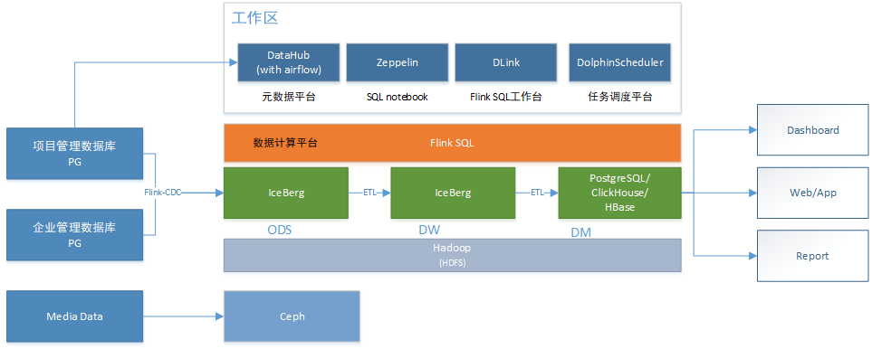

## 整体结构

初步设计的项企数据中台框架，其中：

+ `DataHub` 元数据管理平台；定时抽取PG原数据库的表结构信息
+ `Flink` 数据计算平台，主要负责数据抽取和流转过程的ETL
+ `IceBerg` 数据湖事务层
+ `DM`层使用关系型数据库或列式数据库加速查询效率
+ `DolphinScheduler` 任务调度器(考虑需要实现定时任务)
+ `Zeppelin web notebook`工具，可以执行SQL和Flink查询
+ `Ceph` 提供类似S3接口的文档存储服务




主要功能：

+ 元数据管理  ----- DataHub
  + 自动提取
  + 搜索
  + 标签
  + 权限*
  + 血缘*
+ FlinkSQL提交执行  ----  Dlink
  + sql在线编写
  + sql提交到flink集群
  + sql任务管理
  + sql任务调度
+ 自助取数分析
  + 支持sql在线查询，列表图形展示
  + 自动发布api*


## ODS数据导入

```shell
emis0322.public.notice_popup 通知弹框
emis0322.public.operation_log ES数据
emis0322.public.workflow_action_journal 批阅处理
emis0322.public.workflow_comment 备注
emis0322.public.workflow_process_form_draft 表单草稿
emis0322.public.workflow_process_relation 流程关联人记录表
emis0322.public.workflow_process_version 流程配置版本信息表

workflow0322.public.act_hi_comment 历史流程审批意见表
workflow0322.public.act_hi_detail 历史的流程运行详情表
```


```sql
# 查看当前
select * from pg_replication_slots;
# 删除槽
select * from  pg_drop_replication_slot('flink_xq1_workflow_action_journal');
select * from  pg_drop_replication_slot('flink_xq1_workflow_comment');
select * from  pg_drop_replication_slot('flink_xq1_workflow_process_form_draft');
select * from  pg_drop_replication_slot('flink_xq1_workflow_process_relation');
select * from  pg_drop_replication_slot('flink_xq1_workflow_process_version');
select * from  pg_drop_replication_slot('flink_xq1_operation_log');
select * from  pg_drop_replication_slot('flink_xq1_notice_popup');

```


> 创建新的slot可以重新捞取全量数据


## Flink-Iceberg

开发的一款类似`datax`的数据导入工具，基于Flink。

+ Sources
  + `postgresql` 全库同步，支持批量和`cdc`两种
  + ES 批量，支持按条件查询
+ Sink
  + `Clickhouse`
  + Iceberg


构建：

```sh
mvn install -Panxinyun
```

> 项目中`flink-connector-jdbc`项目为`flink`官方1.13release本地fork，没有作为子模块加入。如有改动，需要先本地构建


执行Flink-Iceberg程序：


参数说明：

1. 主类：`com.fs.Main`
2. 参数：`config=hdfs://10.8.30.37:8020/user/hadoop/flink-job-configs/pgdump.yml`


参数例子：

```yaml
set:
  title: EMIS-CDC-ICEBERG
  execution.checkpointing.interval: 300

source:
  type: postgres-cdc
  config:
    host_port: 10.8.30.156:5432
    database: emis0430
    # Credentials
    username: postgres
    password: postgres
    debezium.slot.name: flink_xq
    debezium.plugin.name: wal2json
    debezium.slot.drop.on.stop: true
    tables: api_log(user_no),notice_popup,operation_log,workflow_action_journal,workflow_comment,workflow_process_form_draft,workflow_process_relation,workflow_process_version

sink:
  type: "iceberg"
  config:
    desc: nothingToSay
  catalog:
    name: iceberg_flink
    type: iceberg
    default-database: ib
    config:
      catalog-type: hadoop
      warehouse: hdfs://10.8.30.37:8020/user/hadoop
      property-version: 1
```


## DataHub

### 概述

Datahub是一个现代化的数据目录，支持端到端的数据发现、数据可观察、数据治理。这个可扩展的元数据平台使开发者能管理不断更新的数据生态系统，数据分析师能够充分利用组织内部的数据。

> DataHub is a modern data catalog built to enable end-to-end data discovery, data observability, and data governance. This extensible metadata platform is built for developers to tame the complexity of their rapidly evolving data ecosystems, and for data practitioners to leverage the full value of data within their organization.


- datahub-gms: Metadata store service
- datahub-frontend: Play application, which serves DataHub frontend
- datahub-mce-consumer: Kafka Streams application that consumes from
  Metadata Change Event (MCE) stream and updates metadata store
- datahub-mae-consumer: Kafka Streams application that consumes from
  Metadata Audit Event (MAE) stream and builds search index and graph
  db


文档：https://datahubproject.io/docs/metadata-ingestion/

用向导创建 `Ingestion`


新增ingestion source:


配置后执行run：

报错

```sh
'ConfigurationError: Unable to connect to http://10.8.30.184:9002/api/gms/config with status_code: 401. Maybe you need to set up '
'authentication? Please check your configuration and make sure you are talking to the DataHub GMS (usually <datahub-gms-host>:8080) or '
'Frontend GMS API (usually <frontend>:9002/api/gms).\n'
```


基于推送的摄取可以使用预构建的发射器，也可以使用我们的框架发出自定义事件。

基于拉取的摄取爬取元数据源。我们已经与 Kafka、MySQL、MS SQL、Postgres、LDAP、Snowflake、Hive、BigQuery 等进行了预构建集成。可以使用我们的 Airflow 集成或其他选择的调度程序来自动化摄取。


### 导入数据[Data Ingestion]

```shell
pip install 'acryl-datahub[datahub-rest]'
pip install 'acryl-datahub[mysql]'
pip install 'acryl-datahub[postgres]'

# recipe.yml
```

```yml
source:
  type: "mysql"
  config:
    username: "root"
    password: "123456"
    host_port: "10.8.30.37:3306"
sink:
  type: "datahub-rest"
  config:
    server: 'http://10.8.30.184:8080'
```

```sh
datahub ingest -c recipe.yml
```

导入项企数据：

```yaml
source:
  type: postgres
  config:
    # Coordinates
    host_port: 10.8.30.156:5432
    database: emis0322

    # Credentials
    username: postgres
    password: postgres

    # Options
    database_alias: emis
    
sink:
  type: "datahub-rest"
  config:
    server: 'http://10.8.30.184:8080'
```


### Great Expectations

通过Great Expectations中的`DataHubValidationAction`对数据质量进行评估。

```
pip install 'acryl-datahub[great-expectations]'
```


需要在Great Expectations的Checkpoint的action_list中增加：

```yaml
action_list:
  - name: datahub_action
    action:
      module_name: datahub.integrations.great_expectations.action
      class_name: DataHubValidationAction
      server_url: http://localhost:8080 #datahub server url
```

关于Great Expectations的配置[Checkpoints and Actions](https://docs.greatexpectations.io/docs/reference/checkpoints_and_actions/);


datahub界面中将展示Assertion状态


### 血统系统 Lineage

使用Airflow作为血缘系统的后端

```sh
pip install acryl-datahub[airflow]

airflow connections add  --conn-type 'datahub_rest' 'datahub_rest_default' --conn-host 'http://localhost:8080'

```

`airflow.cfg`

```yaml
[lineage]
backend = datahub_provider.lineage.datahub.DatahubLineageBackend
datahub_kwargs = {
    "datahub_conn_id": "datahub_rest_default",
    "cluster": "prod",
    "capture_ownership_info": true,
    "capture_tags_info": true,
    "graceful_exceptions": true }
```


## 数据导入

> PREPARE
>
> ```shell
> #清理空间
> hdfs dfs -rm -R -skipTrash /warehouse
> ```
>
> 

