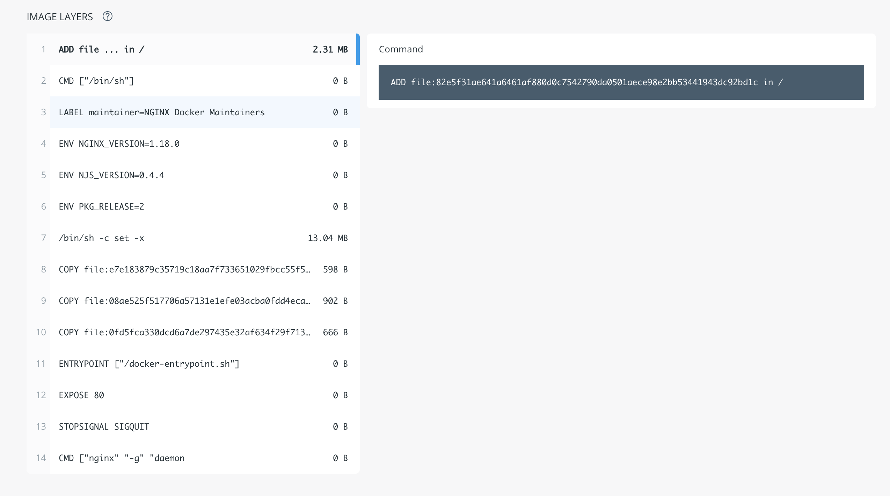
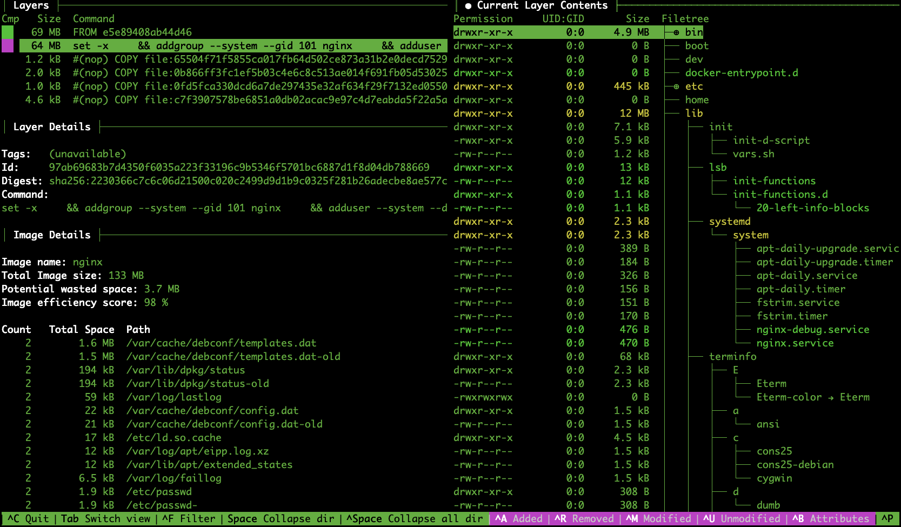

## Docker-Compose命令

https://docs.docker.com/engine/reference/commandline

```
docker-compose pull
docker-compose up

docker-compose create --force-recreate foxapi

docker compose up [OPTIONS] [SERVICE...]
 
Name, shorthand	Default	Description
--abort-on-container-exit		Stops all containers if any container was stopped. Incompatible with -d
--always-recreate-deps		Recreate dependent containers. Incompatible with --no-recreate.
--attach		Attach to service output.
--attach-dependencies		Attach to dependent containers.
--build		Build images before starting containers.
--detach , -d		Detached mode: Run containers in the background
--exit-code-from		Return the exit code of the selected service container. Implies --abort-on-container-exit
--force-recreate		Recreate containers even if their configuration and image haven't changed.
--no-build		Don't build an image, even if it's missing.
--no-color		Produce monochrome output.
--no-deps		Don't start linked services.
--no-log-prefix		Don't print prefix in logs.
--no-recreate		If containers already exist, don't recreate them. Incompatible with --force-recreate.
--no-start		Don't start the services after creating them.
--pull	missing	Pull image before running ("always"|"missing"|"never")
--quiet-pull		Pull without printing progress information.
--remove-orphans		Remove containers for services not defined in the Compose file.
--renew-anon-volumes , -V		Recreate anonymous volumes instead of retrieving data from the previous containers.
--scale		Scale SERVICE to NUM instances. Overrides the scale setting in the Compose file if present.
--timeout , -t	10	Use this timeout in seconds for container shutdown when attached or when containers are already running.
--wait		Wait for services to be running|healthy. Implies detached mode.

# 移除指定服务的volume
docker-compose rm -s -v yourService

# 删除volumne
docker-compose down -v

# # Stop and remove container's using the target volume
docker-compose stop NAME_OF_CONTAINER

# We need the force flag, "-f", as the container is still bound to the volume
docker-compose rm -f NAME_OF_CONTAINER

# Next find your volume name in the following list
docker volume ls

# Finally remove the volume
docker volume rm VOLUME_NAME
```


port:

```sh
ports:
 - "3000"
 - "3000-3005"
 - "8000:8000"
 - "9090-9091:8080-8081"
 - "49100:22"
 - "127.0.0.1:8001:8001"
 - "127.0.0.1:5000-5010:5000-5010"
 - "6060:6060/udp"
```


## 安装

我的ucloudmima是 FS12345678

安装命令如下：

```
curl -fsSL https://get.docker.com | bash -s docker --mirror Aliyun
```

也可以使用国内 daocloud 一键安装命令：

```
curl -sSL https://get.daocloud.io/docker | sh
```

https://www.runoob.com/docker/ubuntu-docker-install.html

## docker 安装Jenkins

1  docker pull jenkinsci/jenkins:lts
docker run -p 8080:8080 -p 50000:50000 -v /your/home:/var/jenkins_home jenkins
镜像存储在 /var/lib/docker
安装docker：

1. apt-get remove docker docker-engine docker.io
2. http://www.cnblogs.com/ksir16/p/6530433.html 
3. https://testerhome.com/topics/5798

1. get intall
apt intall docker.io

2. docker --version
docker run hello-world

build a app:
 Dockerfile
 requirement.txt -- 
 app.py

 docker build -t friendlyhello .

 docker images

 docker run -d -p 4000:80 friendlyhello
 -d 后台  -p 端口映射
 docker container ls
 docker stop 1fa4ab2cf395

 搭建私有仓库 Docker Trusted Registry (DTR)
 sudo docker pull registry
 sudo docker run -d -p 5000:5000 -v /opt/data/registry:/tmp/registry registry

 配置CDN(mirror)
 https://1f3mevbc.mirror.aliyuncs.com
 阿里云 - 开发者平台
 http://www.cnblogs.com/anliven/p/6218741.html
 官方中国区加速镜像：（不好用）
 --registry-mirror=https://registry.docker-cn.com
 163（不好用）
sudo echo "DOCKER_OPTS=\"--registry-mirror=https://1f3mevbc.mirror.aliyuncs.com\"" >> /etc/default/docker
service docker restart


docker exec -it 29d42d8696aa /bin/bash

Cannot connect to the Docker daemon. Is the docker daemon running on this host?.
>> run as sudo

docker 199 jenkins容器实练
sudo docker run -p 8082:8080 -p 50002:50000 -v /home/anxin/jenkins:/var/jenkins_home -v /home/anxin/version:/var/jenkins/version \
-v /var/run/docker.sock:/var/run/docker.sock \
    -v $(which docker):/usr/bin/docker \
    -v ~/.ssh:/var/jenkins_home/.ssh \
	--name=jenkins jenkins-my

♥♥ nsenter 进入容器 （http://blog.csdn.net/u010397369/article/details/41045251）
$ wget https://www.kernel.org/pub/linux/utils/util-linux/v2.24/util-linux-2.24.tar.gz
$ tar -xzvf util-linux-2.24.tar.gz
$ cd util-linux-2.24/
$ ./configure --without-ncurses
$ make nsenter
$ sudo cp nsenter /usr/local/bin

$ sudo docker ps

$ sudo docker inspect -f {{.State.Pid}} 44fc0f0582d9

$ sudo nsenter --target 15230 --mount --uts --ipc --net --pid

mount -t cifs //10.8.30.163/versions /var/jenkins-version -o rw

例子:
sudo nsenter --target `sudo docker inspect -f {{.State.Pid}} ed9440a72d72` --mount --uts --ipc --net --pid

example 0.1: <docker 安装apach打开网站 保存例子> 
docker run -i -t fedora bash
yum update
yum install httpd
exit // 退出容器tty
docker ps -a
docker commit c16378f943fe fedora-httpd
docker images
nano Dockerfile
		FROM fedora-httpd
		ADD mysite.tar /tmp/
		RUN mv /tmp/mysite/* /var/www/html
		EXPOSE 80
		ENTRYPOINT [ "/usr/sbin/httpd" ]
		CMD [ "-D", "FOREGROUND" ]
docker build -rm -t mysite .
docker run -d -P mysite

♥♥
简单介绍下Docker命令：
Docker version / Docker info 查看基本信息，遇到使用问题或者BUG，可以到社区里报告，记得带着这些信息哈。
Docker pull 拉取镜像。
Docker run 从镜像创建一个容器并运行指定的命令常用参数-i -d，建议用—-name命名这个容器，命名后可以使用容器名访问这个容器。
Docker attach（不推荐使用）。
Docker exec -ti CONTAINER /bin/bash 连接到容器上运行bash
Docker logs CONTAINER 查看日志，如run命令后的运行结果，Docker logs -f 查看实时的日志。
Docker kill 杀死Docker容器进程，你可以使用Docker kill $(Docker ps -aq)杀死所有的Docker进程，后者打印出所有的容器的容器id（包括正在运行的，和没有运行的）。
Docker rm CONTAINER 删除一个容器，记得要先停止正在运行的容器，再去删除它。
Docker exec -it <container_id> bash -c 'cat > /path/to/container/file' < /path/to/host/file/容器外向容器内复制文件（也可以用挂载的形式哦）。
Docker commit -a “mike” -m “镜像的一些改动” CONTAINER 当你在容器内做了某种操作后，如增加了一个文件，你可以用这个命令把修改提交，重新打包为镜像。
Docker push 推送镜像。。到这里是不是觉得跟Git的模式已经有点像了呢。
Docker history IMAGES 查看镜像的修改历史。
Docker ps -a | grep "Exited" | awk '{print $1 }'| xargs Docker rm 删除exited的容器。
Docker rmi $(Docker images | awk '/^<none>/ {print $3}') 删除tag为NONE的容器。
Dockerfile基础
Dokcerfile，是的，你还是要稍微掌握下Dockerfile的写法。
From 每个Dockerfile镜像的构建都会基于一个基础镜像，这是你一来的基础镜像name:tag，git。
MAINTAINER （不用记，作者签名）。
ENV 配置环境变量。
COPY 复制本地。
EXPOSE 暴露容器的端口。
WORKDIR 后续命令的执行路径。
RUN important！，执行相应的命令，这一步是在容器构建这一步中执行的命令，一般用作安装软件，操作的结果是持久化在容器里面保存下来的。
Tips：每次执行RUN的时候都是再默认路径执行的，如果要到固定路径下执行命令请在之前加WORKDIR，或者使用RUN (cd workpath && echo "mike")这样把cd命令跟相应的执行命令用括号括起来。
ENTRYPOINT 容器启动后执行的命令。


Docker命令解析[https://studygolang.com/articles/1828]
https://segmentfault.com/a/1190000002978115#articleHeader6
http://blog.csdn.net/u012562943/article/details/52437878
https://segmentfault.com/a/1190000003732967
https://segmentfault.com/a/1190000007837054
http://www.csdn.net/article/2015-08-21/2825511

♥♥ docker go最小容器 alpine + glibc
sudo docker run -it alpine
#安装glibc apk [https://github.com/sgerrand/alpine-pkg-glibc]
apk --no-cache add ca-certificates wget
wget -q -O /etc/apk/keys/sgerrand.rsa.pub https://raw.githubusercontent.com/sgerrand/alpine-pkg-glibc/master/sgerrand.rsa.pub
wget https://github.com/sgerrand/alpine-pkg-glibc/releases/download/2.25-r0/glibc-2.25-r0.apk
apk add glibc-2.25-r0.apk
ok

♥ 本地docker仓库
文章：
	http://blog.csdn.net/shengyiliu/article/details/40658175
	http://blog.csdn.net/wangtaoking1/article/details/44180901/
资源：https://github.com/docker/docker-registry

docker pull registry:latest
mkdir -p /home/anxin/docker-registry/data
修改docker配置：
##/etc/init/docker.config
##exec "$DOCKERD" $DOCKER_OPTS --raw-logs --insecure-registry 10.8.30.199:5000
/etc/default/docker  增加 --insecure-registry 10.8.30.199:5000
另一种方法，自己签发证书[https://github.com/lightning-li/docker-nginx-auth-registry/blob/master/README.md]
sudo docker run -d -p 5000:5000 -v /home/anxin/docker-registry:/opt/docker-image -e SQLALCHEMY_INDEX_DATABASE=sqlite:////opt/docker-image/docker-registry.db -e STORAGE_PATH=/opt/docker-image registry:latest

镜像命名规则：
registry.domain.com/namespace/repository:tags
------------------- --------- ---------- ----
	服务器地址       命名空间   镜像名  版本号

sudo docker tag 10.8.30.199:5000/test/busybox:12.01
sudo docker push 10.8.30.199:5000/test/busybox:12.01

带UI的仓库：
https://hub.docker.com/r/hyper/docker-registry-web/
http://port.us.org/

♥ jenkins中docker构建
(1) docker build step jenkins插件
使用shipyard/docker-proxy Docker server REST API
docker run \
    -ti \
    -d \
    -p 2375:2375 \
    --hostname=$HOSTNAME \
    --restart=always \
    --name shipyard-proxy \
    -v /var/run/docker.sock:/var/run/docker.sock \
    -e PORT=2375 \
    shipyard/docker-proxy:latest
设置 Docker URL -> tcp://10.8.30.199:2375
增加构建步骤  Execute Docker container  -->  create image...
(2) CloudBees Docker Build and Publish plugin
	RepositoryName anxin/gorecv
	Tag 1.0.${BUILD_NUMBER}
	Docker Host URI unix:///var/run/docker.sock
	Docker registry URL http://10.8.30.199:5000


参考文章：
1. https://testerhome.com/topics/5798
2. http://www.linuxidc.com/Linux/2015-07/120287.htm
3. http://www.cnblogs.com/soar1688/p/6833540.html

♥ jenkins中无法使用docker
是用 -v /var/run/docker.sock:/var/run/docker.sock \
     -v $(which docker):/usr/bin/docker \
	 的方式
 docker exec jenkins ls -la /var/run/docker.sock 查看文件权限，发现没有jenkins用户权限
 whoami && id
 chown -R 1000 /var/run/docker.sock
 chown -R 1000 /usr/bin/docker
 ok

163 docker试炼
sudo docker run -d -p 8088:8080 -p 50005:50000 -v /docker/jenkins/:/var/jenkins_home -v /versions:/versions -v ~/.ssh:/var/jenkins_home/.ssh -v /etc/localtime:/etc/localtime:ro -v /var/run/docker.sock:/var/run/docker.sock -v $(which docker):/usr/bin/docker -e JAVA_OPTS=-Duser.timezone=Asia/Shanghai --restart=always --name=myjenkins 10.8.30.163:5005/jenkins:10.28


## Containerd

Containerd是一个轻量级的容器系统

| id   | containerd 命令                       | docker 命令                           | 备注                      |
| ---- | ------------------------------------- | ------------------------------------- | ------------------------- |
| 1    | ctr image ls                          | docker images                         | 获取image信息             |
| 2    | ctr image pull nginx                  | docker pull nginx                     | pull 一个nginx的image     |
| 3    | ctr image tag nginx nginx-test        | docker tag nginx nginx-test           | tag 一个nginx的image      |
| 4    | ctr image push nginx-test             | docker push nginx-test                | push nginx-test的image    |
| 5    | ctr image pull nginx                  | docker pull nginx                     | pull 一个nginx的image     |
| 6    | ctr image import nginx.tar            | docker load<nginx.tar.gz              | 导入本地镜像ctr不支持压缩 |
| 7    | ctr run -d --env 111 nginx-test nginx | docker run -d --name=nginx nginx-test | 运行的一个容器            |
| 8    | ctr task ls                           | docker ps                             | 查看运行的容器            |


## Dockerfile From Image

https://stackoverflow.com/questions/19104847/how-to-generate-a-dockerfile-from-an-image

> How to generate or reverse a Dockerfile from an image?

You can. Mostly.

Notes: It does not generate a `Dockerfile` that you can use directly with `docker build`; the output is just for your reference.

```
alias dfimage="docker run -v /var/run/docker.sock:/var/run/docker.sock --rm alpine/dfimage"
dfimage -sV=1.36 nginx:latest
```

It will pull the target docker image automatically and export `Dockerfile`. Parameter `-sV=1.36` is not always required.

Reference: https://hub.docker.com/repository/docker/alpine/dfimage

Now hub.docker.com shows the image layers with detail commands directly, if you choose a particular tag.

[](https://i.stack.imgur.com/k4A8E.png)

### Bonus

If you want to know which files are changed in each layer

```
alias dive="docker run -ti --rm  -v /var/run/docker.sock:/var/run/docker.sock wagoodman/dive"
dive nginx:latest
```

[](https://i.stack.imgur.com/NlUlw.png)

On the left, you see each layer's command, on the right (jump with tab), the yellow line is the folder that some files are changed in that layer

(Use SPACE to collapse dir)