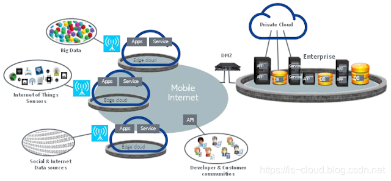
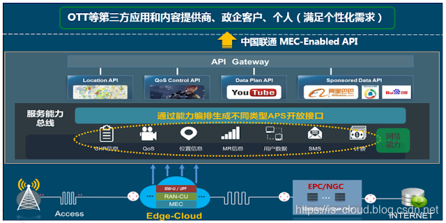
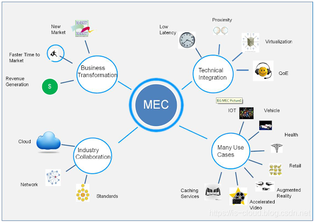
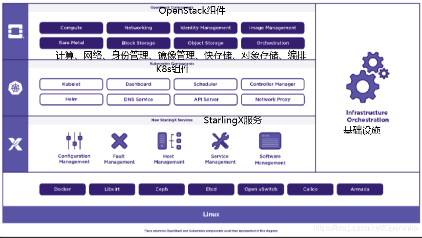
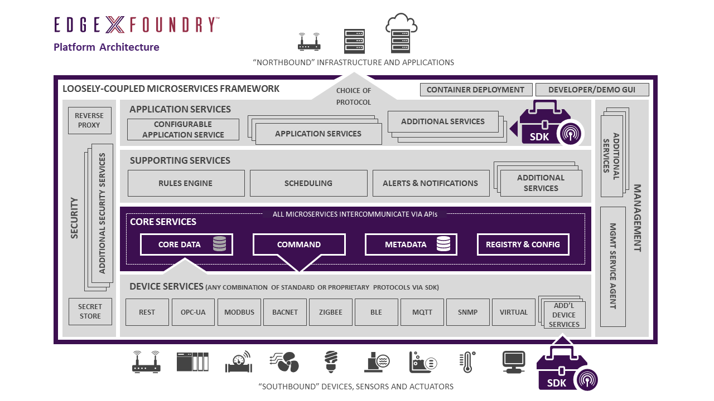
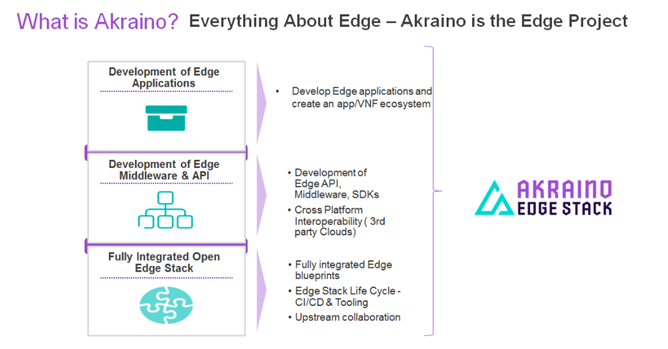
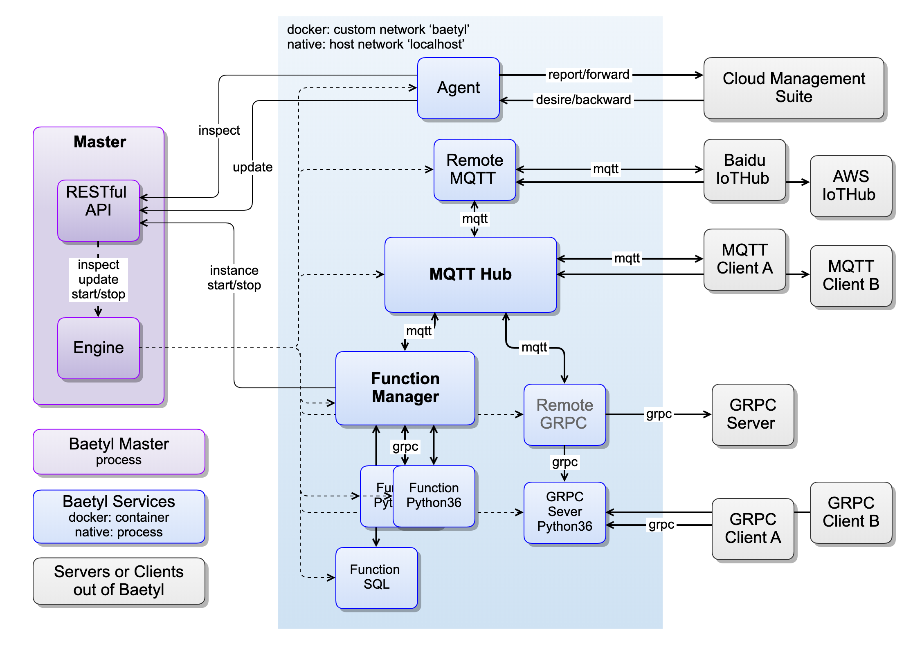
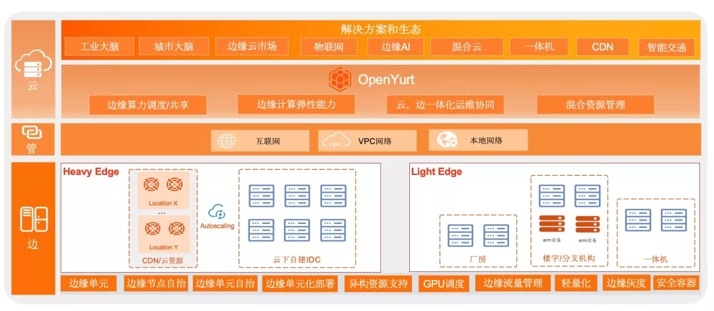
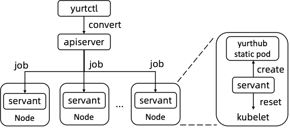

## 边缘计算是什么

### 概念

边缘计算**EC** （**Edge Computing**）是靠近物或数据源一侧，采用网络、计算、存储、应用核心能力为一体的开放平台，就近提供最近端服务。

优点： **实时**业务、应用**智能**、安全和**隐私**保护；

大神们说什么：

+ 边缘计算是当前的行动之所在。(*George Burns* @SPR)
+ 很多组织现在可以将云计算技术用于需要‘接近度计算’的用例。这可以提高生产力，降低成本，甚至产生新的收入模式。 (*Shamik Mishra*)
+ 边缘计算使数据和计算更接近交互点。(*E.G. Nadhan*)

+ 让边缘自己收集数据、分享见解(*E.G. Nadhan*)
+ 更灵活的对不断变化的业务需求做出反应 (*Dave McCarthy*)
+ 这一切归结为一个概念：访问质量。减少了在用户与他们尝试访问的资源之间传输的物理距离 (*Burns*)
+ 制造业、零售业、健康、能源和公用事业等行业计划在采用边缘解决方案的基础上加倍努力(*Yugal Joshi*)
+ 这是内容交付网络(CDN)的新增功能。(*Blum* @PubNub)

 

​	把边缘计算类比为 计算机中 的 `Memory`和`Cache`的概念，把用户常用的数据放在离用户比较近的边缘云（Edge-Cloud）上，达到降低用户存取网络信息/服务的延迟，同时降低核心网络的流量负担。

典型应用场景：

+ **物联网、工业互联网、交通、能源、零售、智慧城市、智慧建筑、云游戏、互动直播**
+ **CDN**也属于一种边缘计算。*CDN (Content Delivery Network 内容分发网络) 通过遍布全国的缓存边缘节点、内部专用线路以及完善的网络路由调度机制为用户自动选择最佳网络访问路径，将源站的内容分发到最接近用户的网络边缘节点*

### 电信网络中涉及的边缘计算思想

如下图，将原本放在电信运营商核心网或数据中心中的 APPs 跟 Services 迁移到了边缘云中，而使用者或是开发者只要透过 API 就能存取/使用边缘云上的资源/服务。[[1](https://www.cnblogs.com/jmilkfan-fanguiju/p/11825026.html)]

例如中国联通的MEC Server

5G技术中中引入了边缘计算（[Multiple Edge Computing](https://www.cnblogs.com/jmilkfan-fanguiju/p/11825026.html)）。

 

### 在监测领域可以做什么？ 

+ 网络状况差

  电信网络覆盖较差的地区，通过云端下发采集指令可能出现丢失或超时的情况。可以通过边缘节点（网关）采集数据，在网络状态恢复后，将数据发送到云端

+ 时延要求高

  一些业务场景要求的数据实时性较高，如果把数据传输到平台经过ETL和决策分析，往往有比较高的时延。某些应用场景：如工地实时安全监测、人脸识别等，这样会造成较差的体验。下层云平台业务代码，可实现在边缘实时告警。

+ 减少云端压力

  数据频率较高的数据，上传到云端，对网络、存储、CPU消耗都是比较大的，这就增加了平台服务器的成本，而且很多都是无效的垃圾数据。边缘计算场景下，可以在边缘节点，进行数据的筛选清洗和部分分析、告警功能，将处理后的数据上报到平台，减少平台的压力

## 开源框架
✗✓
[选型对比](https://www.cnblogs.com/wsjhk/p/12103998.html)

| EdgeX Foundry    | K3S    | KubeEdge | StarlingX        | OpenEdge |        |
| ---------------- | ------ | -------- | ---------------- | -------- | ------ |
| 云边协同         | ✘ | ✘   | ✔             | ✔      | ✔    |
| 原生支持K8S      | 不支持 | 支持     | 支持             | 不支持   | 不支持 |
| 边缘组件资源占用 | 中     | 小       | 最小（内存256M） | 较大     | 较大   |
| 部署复杂度       | 复杂   | 简单     | 简单             | 复杂     | 复杂   |
| 是否去中心化     | 否     | 否       | 是               | 否       | 否     |
| 是否支持MQTT     | 支持   | 支持     | 支持             | 支持     | 支持   |
| 容器化编排       | 不支持 | 支持     | 支持             | 支持     | 不支持 |

###  [KubeEdge](https://github.com/kubeedge/kubeedge)

华为开源产品，构建在Kubernetes之上，并将本机容器化应用程序编排和设备管理扩展到边缘主机。，打通了云、边、端的整体流程：
+ 用户能够在云上统一管理边缘节点上的应用、设备
+ 提供了云边协同的能力，能够同步云边的应用、设备的数据
+ 针对复杂多样的边缘设备，KubeEdge定义了一套通用的设备管理API（K8s CRD）以及设备协议解耦层，用户可以方便地使用KubeEdge在云上管理各种边缘设备
+ 针对云边网络不稳定的情况，提供了云边数据协同的可靠性传输、边缘元数据持久化
+ 针对边缘资源不足的情况，轻量化裁剪了Kubelet，支持在256MB的小型设备上运行

优势：

+ 原生支持kubernetes
+ 云边缘可靠协作
+ 边缘自治
+ 边缘设备管理：通过CRD实现的Kubernetes本地api管理边缘设备。
+ 极轻量边缘代理 （EdgeCore）

### StarlingX

[doc](https://docs.starlingx.io/)

Intel和*WindRiver*开源的边缘计算项目。StarlingX是一个软件栈，他包含了打包，编译，安装配置，openstack本身，WindRiver的MTCE平台，以及WindRiver针对电信云开发的VIM等等。基于OpenStack的大规模边缘计算方案，集成了OpenStack的核心服务用于实现计算，网络，存储等能力。目标是实现边缘端的无人值守，虚拟机级别的管理。边缘端组成边缘云互相协同，以及和中心云实现协同。

### EdgeX Foundry

 Linux基金组织的开源项目。偏重于端侧设备的管理，定位是通用工业IOT边缘计算通用框架，提供了一些设备接入、边缘数据传输等场景的实现，但不具备云上对边缘端的应用和设备的管控、云边协同等智能边缘系统的能力，架构组件之间依赖复杂。

**DELL**开源的FUSE （Java SPRING CLOUD）源代码基础之上建立。

提供Go、C的设备服务驱动。

EdgeX的四层结构： 

+ Application Services

  应用程序服务是从EdgeX提取、处理/转换和发送感测数据到您选择的端点或进程的手段。

+ Supporting Services

  支撑服务包括范围广泛的微服务，包括边缘分析（也称为本地分析）。正常的软件应用程序职责，如日志记录、调度和数据清理（在EdgeX中也称为清理）由支持服务层中的微服务执行。

  + Rules Engine:根据边缘传感器数据执行if-then条件判断
  + Scheduling 内部的EdgeX“时钟”，通过定时服务请求EdgeX的REST接口触发操作。
  + 日志记录
  + 警报和通知

+ Core Services

  EdgeX南北联系中介，thing的连接、数据流动、EdgeEx实例配置均在这里

  + Core Data

    一个持久性存储库和相关的管理服务，用于从南侧对象收集的数据。

  + Command

    一种服务，它促进和控制从北侧到南侧的驱动请求。

  + MetaData

    一种存储库和与之相关的元数据管理服务，用于连接到EdgeX Foundry的对象。元数据提供了提供新设备并将其与其所拥有的设备服务配对的功能。

  + Registry & Config

    向其他EdgeX Foundry micro服务提供有关EdgeX Foundry和micro services配置属性（即初始化值存储库）中相关服务的信息。

+ Device Services

  提供“thing”的连接

### K3s

Rancher Labs的开源产品。K3s是在边缘运行整个K8s集群的方案，不具备云边协同的能力；其次K3s虽然对K8s做了轻量化，但整体资源要求仍然较高，无法运行在IOT Hub、工业网关等小型设备中。

k3s是经CNCF一致性认证的**轻量级**Kubernetes发行版，专为物联网及边缘计算设计。

### OpenEdge

[非官方文档](https://www.bookstack.cn/read/OpenEdge/3.md)

百度开源的面向端的工业互联网智能边缘计算方案，需要和百度的云端管理套件BIE结合实现云边协同。

>  **模块化** **容器化**  **按需使用、按需部署**  **一键式构建**  **资源隔离与限制**

包含：

- 主程序(master)
  - [模块引擎(engine)](https://www.bookstack.cn/read/OpenEdge/3.md#模块引擎(engine))
  - [云代理(agent)](https://www.bookstack.cn/read/OpenEdge/3.md#云代理(agent))  负责和云端管理套件通讯（MQTT/HTTPS）
  - [API(api)](https://www.bookstack.cn/read/OpenEdge/3.md#API(api))  支持获取空闲端口，模块的启动和停止
  - [环境变量(env)](https://www.bookstack.cn/read/OpenEdge/3.md#环境变量(env))  
- 官方模块
  - Hub模块（openedge-hub） <Hub模块是一个单机版的消息订阅和发布中心，采用MQTT 3.1.1协议>
    - [函数计算模块（openedge-function）](https://www.bookstack.cn/read/OpenEdge/3.md#函数计算模块（openedge-function）)
    - [函数计算python27 runtime模块（openedge-function-runtime-python27）](https://www.bookstack.cn/read/OpenEdge/3.md#函数计算python27 runtime模块（openedge-function-runtime-python27）)
  - [远程通讯模块（openedge-remote-mqtt）](https://www.bookstack.cn/read/OpenEdge/3.md#远程通讯模块（openedge-remote-mqtt）)

HUB模块：

### 其他

#### Akraino

Akraino Edge Stack基金项目，支持针对边缘计算系统和应用程序优化的高可用性云服务。

包含三层：

+ 应用部署：负责部署边缘应用并创建app/VNF的边缘生态系统
+ 边缘中间件和API: 创建标准的边缘平台和中间件，统一API和SDK接口
+ 底层对接开源IaaS，比如OpenStack、Kubernetes

设计原则：

Edge计算解决方案需要大规模部署，Akraino项目的关键要求是保持低成本并确保其通过自动化支持大规模部署。 Akraino社区与多个上游开源社区（如Airship，OpenStack，ONAP等）合作，提供完全集成的堆栈，支持远程配置和集成堆栈的远程生命周期管理。

#### Baetyl

百度OpenEdge的新名字

#### OpenYurt

?? *未完全开源*

阿里开源**OpenYurt 主打“云边一体化”概念**。

依托 Kubernetes 强大的容器应用编排能力，满足了云-边一体化的应用分发、交付、和管控的诉求。相较于其他基于 Kubernetes 的边缘计算框架，OpenYurt 秉持着“最小修改”原则，通过在边缘节点安装 Yurthub 组件，和在云端部署 Yurt-controller-manager，保证了在对 Kubernetes 零侵入的情况下，提供管理边缘计算应用所需的相关能力。OpenYurt 能帮用户解决在海量边、端资源上完成大规模应用交付、运维、管控的问题，并提供中心服务下沉通道，实现和边缘计算应用的无缝对接。在设计 OpenYurt 之初，我们就非常强调保持用户体验的一致性，不增加用户运维负担，让用户真正方便地 **“Extending your native kubernetes to edge”**。

**OpenYurt 的主要组件包括：**

- **YurtHub**：一个节点守护程序，用作来自Kubernetes节点守护程序（Kubelet，Kubeproxy，CNI插件等）的出站流量的代理。它在边缘节点的本地存储中缓存Kubernetes节点守护程序可能访问的所有资源的状态。如果边缘节点处于脱机状态，则这些守护程序可以在节点重新启动时恢复状态。
- **Yurt控制器管理器**：针对不同的边缘计算用例，它管理一些控制器，例如节点控制器和单元控制器（即将发布）。例如，`autonomy`即使缺少节点心跳，也不会从APIServer退出处于该模式的节点中的Pod。
- **Yurt隧道服务器**：它`TunnelAgent`通过反向代理与在每个边缘节点中运行的守护程序连接，以在云站点控制平面和连接到Intranet（将要发布）的边缘节点之间建立安全的网络访问。

#### SuperEdge

腾讯云开源，**基于原生 Kubernetes 的边缘容器管理系统。**

云端组件：

- [**tunnel-cloud**](https://github.com/superedge/superedge/blob/main/docs/components/tunnel_CN.md): 云端tunnel服务组件，用于建立云边长连接隧道，支持代理tcp/http/https流量
- [**application-grid controller**](https://github.com/superedge/superedge/blob/main/docs/components/service-group_CN.md): 应用网络（serviceGroup）控制器
- [**edge-health admission**](https://github.com/superedge/superedge/blob/main/docs/components/edge-health_CN.md): 分布式节点健康检查机制云端组件，辅助Kubernetes控制器工作

边端组件:

- [**lite-apiserver**](https://github.com/superedge/superedge/blob/main/docs/components/lite-apiserver_CN.md): 节点侧轻量版apiserver shadow，代理节点组件到云端apiserver的请求，缓存关键数据以用于边缘自治
- [**edge-health**](https://github.com/superedge/superedge/blob/main/docs/components/edge-health_CN.md): 分布式节点健康检查，用于感知边缘节点状态，支持对节点分区域检查能力
- [**tunnel-edge**](https://github.com/superedge/superedge/blob/main/docs/components/tunnel_CN.md): 边缘tunnel服务组件，主动与tunnel-cloud建立长连接，将云端请求代理到对应的边缘服务，如：kubelet、业务pod等
- [**application-grid wrapper**](https://github.com/superedge/superedge/blob/main/docs/components/service-group_CN.md): 应用网格流量控制组件，可将svc之间的流量闭环在同一个应用网格之中，避免跨网格访问

#### Azure IoT Edge

微软基于**Azure IoT Hub**构建的 IoT 服务。

包含三个组件：

- **IoT Edge modules**是容器，可以运行 Azure 服务、或者你自己的代码，IoT Edge Runtime包含Moby引擎。
- **IoT Edge runtime**在每个 IoT Edge 设备上运行，并管理部署到每个设备的模块。
- **Cloud-based interface**可以通过基于云的界面远程监视和管理 IoT Edge 设备。

#### EdgeGallery

由中国信息通信研究院、中国移动、中国联通、华为、腾讯、紫金山实.验室、九州云和安恒信息等八家创始成员发起的5G边缘计算开源项目，其目的是打造一个以“联接+计算”为特点的5G MEC公共平台，实现网络能力（尤其是5G网络）开放的标准化和MEC应用开发、测试、迁移和运行等生命周期流程的通用化。

开源项目：[EdgeGallery MEP](https://gitee.com/edgegallery/mep)。 MEP（Mobile Edge Platform）

优势： `国内`  `5G`

#### DC3

[Gitee上的开源项目]() 

一整套的IoT解决方案

DC3是基于Spring Cloud的开源可分布式物联网(IOT)平台,用于快速开发、部署物联设备接入项目,是一整套物联系统解决方案。
