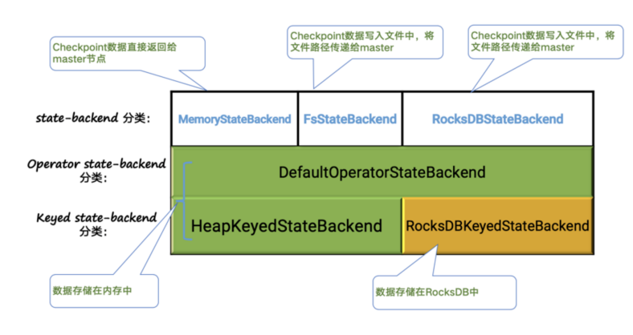
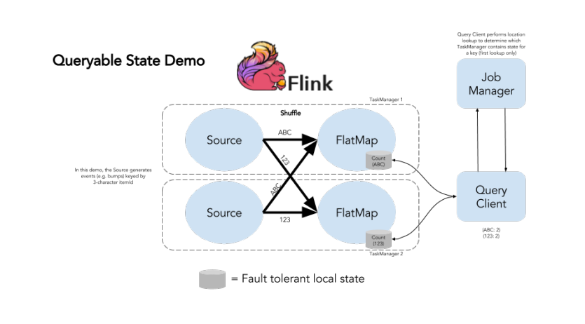

## Day 6

### Operator State

和Keyed State相对. 支持状态的重新分布，不常用，主要用于Source和Sink，例如KafkaConsumer中offset的管理。

+ ListState
+ UnionListState
+ BroadcastState

两种定义：

+ 实现CheckpointedFunction接口
+ 实现ListCheckpointed接口定义（已废弃）

通过operatorState实现BufferSink

```java
class BufferingSinkFunction
        implements SinkFunction<Tuple2<String, Integer>>,
        CheckpointedFunction {

    private final int threshold;

    // operator state
    private transient ListState<Tuple2<String, Integer>> checkpointedState;

    private List<Tuple2<String, Integer>> bufferedElements;

    public BufferingSinkFunction(int threshold) {
        this.threshold = threshold;
        this.bufferedElements = new ArrayList<>();
    }

    @Override
    public void invoke(Tuple2<String, Integer> value, Context contex) throws Exception {
        bufferedElements.add(value);
        if (bufferedElements.size() == threshold) {
            for (Tuple2<String, Integer> element : bufferedElements) {
                // send it to the sink
            }
            bufferedElements.clear();
        }
    }

            // CheckpointedFunction 将数据存储到checkpoint state中
    @Override
    public void snapshotState(FunctionSnapshotContext context) throws Exception {
        checkpointedState.clear();
        for (Tuple2<String, Integer> element : bufferedElements) {
            checkpointedState.add(element);
        }
    }

            // CheckpointedFunction 从checkpoint中加载数据
    @Override
    public void initializeState(FunctionInitializationContext context) throws Exception {
        ListStateDescriptor<Tuple2<String, Integer>> descriptor =
                new ListStateDescriptor<>(
                        "buffered-elements",
                        TypeInformation.of(new TypeHint<Tuple2<String, Integer>>() {
                        }));

        checkpointedState = context.getOperatorStateStore().getListState(descriptor);

        if (context.isRestored()) {
            for (Tuple2<String, Integer> element : checkpointedState.get()) {
                bufferedElements.add(element);
            }
        }
    }
}
```


### Broadcast State

常用在动态规则（例如告警规则更新事件）、数据丰富过程。要求广播的数据吞吐量较低。

```java
...
KeyedStream<Action, Long> actionsByUser = actions
                .keyBy((KeySelector<Action, Long>) action -> action.userId);

        MapStateDescriptor<Void, Pattern> bcStateDescriptor =
                new MapStateDescriptor<>("patterns", Types.VOID, Types.POJO(Pattern.class));

        BroadcastStream<Pattern> bcedPatterns = patterns.broadcast(bcStateDescriptor);

        DataStream<Tuple2<Long, Pattern>> matches = actionsByUser
                .connect(bcedPatterns) // 用户行为流和操作规则流connect
                .process(new PatternEvaluator());
...

public static class PatternEvaluator
            extends KeyedBroadcastProcessFunction<Long, Action, Pattern, Tuple2<Long, Pattern>> {

        // handle for keyed state (per user)
        ValueState<String> prevActionState;
        // broadcast state descriptor
        MapStateDescriptor<Void, Pattern> patternDesc;

        @Override
        public void open(Configuration conf) {
            // initialize keyed state
            prevActionState = getRuntimeContext().getState(
                    new ValueStateDescriptor<>("lastAction", Types.STRING));
            patternDesc =
                    new MapStateDescriptor<>("patterns", Types.VOID, Types.POJO(Pattern.class));
        }

        /**
         * Called for each user action.
         * Evaluates the current pattern against the previous and
         * current action of the user.
         */
        @Override
        public void processElement(
                Action action,
                ReadOnlyContext ctx,
                Collector<Tuple2<Long, Pattern>> out) throws Exception {
            // get current pattern from broadcast state
            Pattern pattern = ctx
                    .getBroadcastState(this.patternDesc)
                    // access MapState with null as VOID default value
                    .get(null);
            // get previous action of current user from keyed state
            String prevAction = prevActionState.value();
            if (pattern != null && prevAction != null) {
                // user had an action before, check if pattern matches
                if (pattern.firstAction.equals(prevAction) &&
                        pattern.secondAction.equals(action.action)) {
                    // MATCH
                    out.collect(new Tuple2<>(ctx.getCurrentKey(), pattern));
                }
            }
            // update keyed state and remember action for next pattern evaluation
            prevActionState.update(action.action);
        }

        /**
         接收到广播流
         * Called for each new pattern.
         * Overwrites the current pattern with the new pattern.
         */
        @Override
        public void processBroadcastElement(
                Pattern pattern,
                Context ctx,
                Collector<Tuple2<Long, Pattern>> out) throws Exception {
            // store the new pattern by updating the broadcast state
            BroadcastState<Void, Pattern> bcState = ctx.getBroadcastState(patternDesc);
            // storing in MapState with null as VOID default value
            bcState.put(null, pattern);
        }
    }
```

注意：

1. 广播流侧(processBroadcastElement)可以修改broadcast state。数据流侧（processElement）只能读broadcast state。
2. 目前broadcast state只支持存储在内存中。


### 容错

状态计算函数，通过检查点（checkpoint）将算子中的数据异步存储到文件系统中。

基于异步屏障快照方法实现。

实现AtleastOnce和ExactlyOnce容错。

JM中checkpoint coordinator触发source节点task的checkpoint动作，source节点向下游广播`barrier`。当task完成备份后会将备份数据的地址（state handle）通知给checkpoint coordinator。JM的checkpoint coordinator再将checkpoint元数据持久化。

`barrier`（栅栏）将datastream分段进行checkpoint。算子之间会进行align（对齐）操作，会照成task的一定阻塞。Unaligned Checkpoint（>1.11）做了优化。

```java
StreamExecutionEnvironment enableCheckpointing(long interval,CheckpointingMode mode)
```

```java

        //获取flink的运行环境
        StreamExecutionEnvironment env = StreamExecutionEnvironment.getExecutionEnvironment();

        // 每隔1000 ms进行启动一个检查点【设置checkpoint的周期】
        env.enableCheckpointing(1000);
        // 高级选项：
        // 设置模式为exactly-once （这是默认值）
        env.getCheckpointConfig().setCheckpointingMode(CheckpointingMode.EXACTLY_ONCE);
        // 确保检查点之间有至少500 ms的间隔【checkpoint最小间隔】
        env.getCheckpointConfig().setMinPauseBetweenCheckpoints(500);
        // 检查点必须在一分钟内完成，或者被丢弃【checkpoint的超时时间】
        env.getCheckpointConfig().setCheckpointTimeout(60000);
        // 同一时间只允许进行一个检查点
        env.getCheckpointConfig().setMaxConcurrentCheckpoints(1);
        // 表示一旦flink处理程序被cancel后，会保留Checkpoint数据，以便根据实际需要恢复到指定的Checkpoint
        //ExternalizedCheckpointCleanup.RETAIN_ON_CANCELLATION:表示一旦Flink处理程序被cancel后，会保留Checkpoint数据，以便根据实际需要恢复到指定的Checkpoint
        //ExternalizedCheckpointCleanup.DELETE_ON_CANCELLATION: 表示一旦Flink处理程序被cancel后，会删除Checkpoint数据，只有job执行失败的时候才会保存checkpoint
  env.getCheckpointConfig().enableExternalizedCheckpoints(CheckpointConfig.ExternalizedCheckpointCleanup.RETAIN_ON_CANCELLATION);

        //设置statebackend
        env.setStateBackend(new FsStateBackend("file://" + System.getProperty("user.dir") + "/WorkSpace/checkpoints"));
//        env.setStateBackend(new FsStateBackend("hdfs://node02:8020/com.elephent.flink/checkpoints"));

```


### Savepoint

特殊的checkpoint。人为干预的检查点（保存点）。checkpoint目标是程序异常时保存状态以恢复，savepoint是人为停机维护时进行。checkpoint时flink runtime自发管理和触发，savepoint是用户手动触发。checkpoint支持增量更新，较轻量。Savepoint会长久持久化，作业可以人为地从Savepoint中恢复。

```sh
bin/flink savepoint :jobId [:targetDirectory]
bin/flink cancle -s [:targetDirectory] :jobId # cancel job时savepoint
bin/flink run -s :savepointPath [:runArgs] # 从savepoint中恢复
```

在flink-conf.yaml中设定：

```yaml
state.savepoints.dir: hdfs:///flink/savepoints
```

通常需要指定算子的uid，才能做代码升级过程中的savepoint，实现向下兼容。

```scala
val stream=env
.addSource(new StatefulSource())
.uid("sourceid")
.shuffle()
.map(new StatefulMapper())
.uid("mapperid")
.print()
```


### StateBackend



分为MemoryStateBackend (jobmanager)/FsStateBackend (filesystem)/RocksDBStateBackend (rocksdb)（K-V）。

JVM Heap -> FileSystem

RocksDB -> FileSystem在使用rocksdb作为backend的时候，需要在项目中引入

```xml
<dependency>
    <groupId>org.apache.flink</groupId>
    <artifactId>flink-statebackend-rocksdb_2.11</artifactId>
    <version>${flink.version}</version>
</dependency>
```

在flink-conf.yaml中配置 `state.backend.incremental: true` 实现rocksdb的增量检查点保存。

```java
env.setStateBackend(new RocksDBStateBackend("file://...").configure(conf,classLoader))
```


### State Schema Evolution

状态架构升级。

POJO type字段增删,Flink支持它的模式演进。

Avro types Flink完全支持其模式状态演进。 Kryo不支持模式演进。

其他：用户自己定义序列化工具。

```java
ValueStateDescriptor<MyStateType> desc=
                new ValueStateDescriptor<MyStateType>(
                        "mystatetype",
                        new SerializerV1()
                );
```


State serialization 分为 in heap-based和off-heap两种模式。rockdbs是off-heap模式。


### Querable State

可查询状态。

不需要事先写入到外围存储介质，直接通过rpc到taskmanager获取state统计数据。(将flink系统作为数据库使用。)



flink-conf.yaml

```yaml
querable-state.enable: true
```

添加flink querable支持

```sh
cp ${FLINK_HOME}/opt/flink-qurable-state-runtime_2.11-1.11.0.jar  ${FLINK_HOME}/lib/
```

重启flink集群,TM日志：

```sh
》Started Queryable State Server @ /x.x.x.x:9067
> Started Queryable State Proxy @ /x.x.x.x:9096
```

应用代码中 KeyedStream -> QueryableStream.


### 交易欺诈项目

先跑起来：[windows安装docker](https://www.cnblogs.com/yunfeifei/p/13158845.html)

```sh
#Powershell
Enable-WindowsOptionalFeature -Online -FeatureName Microsoft-Windows-Subsystem-Linux
Enable-WindowsOptionalFeature -Online -FeatureName VirtualMachinePlatform
wsl --set-default-version 2
# 商店中安装ubuntu
# https://docs.microsoft.com/en-us/windows/wsl/install-manual#downloading-distributions
# WslRegisterDistribution failed with error: 0x800701bc
# 下载最新wsl2 linux支持包 https://wslstorestorage.blob.core.windows.net/wslblob/wsl_update_x64.msi
# WslRegisterDistribution failed with error: 0x80370102
# 未启用虚拟化，进入BIOS设置
# 不受支持的控制台设置.若要使用此功能,必须禁用旧的控制台
# 

sudo apt-get install apt-transport-https ca-certificates curl gnupg2 software-properties-common

# 信任 Docker 的 GPG 公钥：
#curl -fsSL https://download.docker.com/linux/ubuntu/gpg | sudo apt-key add -

cp /etc/apt/sources.list /etc/apt/sources.list.bak

echo "deb http://mirrors.aliyun.com/ubuntu/ focal main restricted
deb http://mirrors.aliyun.com/ubuntu/ focal-updates main restricted
deb http://mirrors.aliyun.com/ubuntu/ focal universe
deb http://mirrors.aliyun.com/ubuntu/ focal-updates universe
deb http://mirrors.aliyun.com/ubuntu/ focal multiverse
deb http://mirrors.aliyun.com/ubuntu/ focal-updates multiverse
deb http://mirrors.aliyun.com/ubuntu/ focal-backports main restricted universe multiverse
deb http://mirrors.aliyun.com/ubuntu/ focal-security main restricted
deb http://mirrors.aliyun.com/ubuntu/ focal-security universe
deb http://mirrors.aliyun.com/ubuntu/ focal-security multiverse">/etc/apt/sources.list
apt update && apt upgrade -y

$ curl -fsSL https://get.docker.com -o get-docker.sh
$ sudo sh get-docker.sh
$ sudo service docker start
#启动成功后，我们可以用一些常用的docker命令来测试docker是否启动成功，如：

docker images
docker search nginx

#最简单的测试方法，运行docker的helloworld，命令如下：

docker run hello-world
#这里使用了nginx的镜像进行了测试，命令如下：

docker pull nginx
docker run --name nginx -p 8080:80 -d nginx
```


## FAQ

1. No ExecutorFactory found to execute the application.

   ```xml
   <dependency>
       <groupId>org.apache.flink</groupId>
       <artifactId>flink-clients_2.11</artifactId>
       <version>${flink.version}</version>
   </dependency>
   ```

2. 