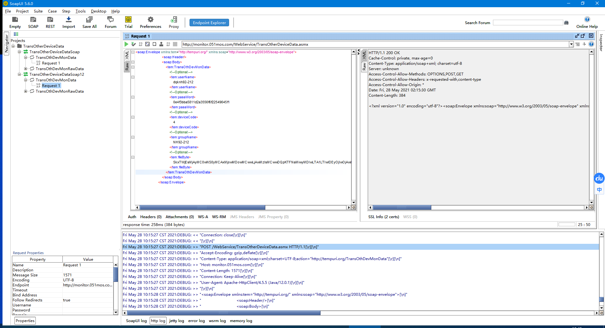
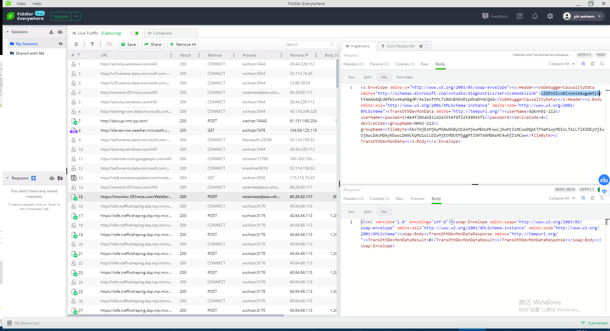
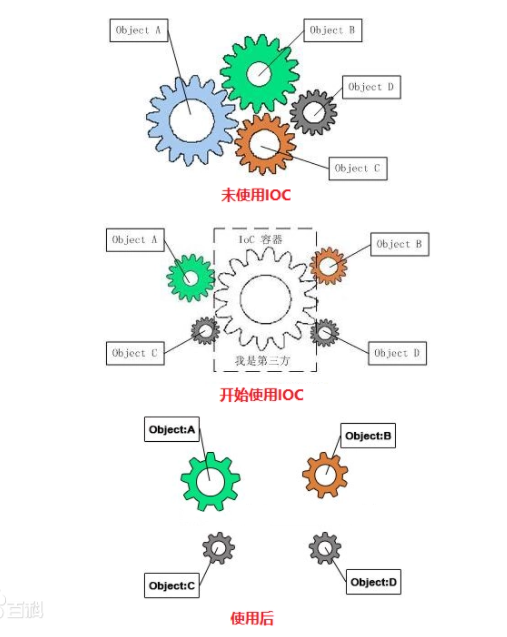
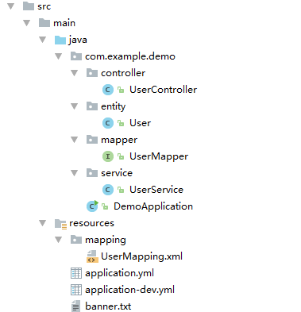

JAVA&SCALA
=====

## JAVA引用webservice:
wsdl2java.bat -p wsdl.jiangsu -d wsdljiangsu  -encoding utf-8 -client http://58.213.116.130:9001/MonitorService-1.0/services/MonitorService?wsdl

wsdl2java.bat -p wsdl.jiangsu -d wsdljiangsutest  -encoding utf-8 -client http://61.132.52.36:9001/MonitorService-1.0/services/MonitorService?wsdl

## JVM 内存

[ref](https://www.cnblogs.com/likehua/p/3369823.html)
        常见配置汇总
        堆设置
        -Xms:初始堆大小
        -Xmx:最大堆大小
        -XX:NewSize=n:设置年轻代大小
        -XX:NewRatio=n:设置年轻代和年老代的比值。如:为3，表示年轻代与年老代比值为1：3，年轻代占整个年轻代年老代和的1/4
        -XX:SurvivorRatio=n:年轻代中Eden区与两个Survivor区的比值。注意Survivor区有两个。如：3，表示Eden：Survivor=3：2，一个Survivor区占整个年轻代的1/5
        -XX:MaxPermSize=n:设置持久代大小
        收集器设置
        -XX:+UseSerialGC:设置串行收集器
        -XX:+UseParallelGC:设置并行收集器
        -XX:+UseParalledlOldGC:设置并行年老代收集器
        -XX:+UseConcMarkSweepGC:设置并发收集器
        垃圾回收统计信息
        -XX:+PrintGC
        -XX:+PrintGCDetails
        -XX:+PrintGCTimeStamps
        -Xloggc:filename
        并行收集器设置
        -XX:ParallelGCThreads=n:设置并行收集器收集时使用的CPU数。并行收集线程数。
        -XX:MaxGCPauseMillis=n:设置并行收集最大暂停时间
        -XX:GCTimeRatio=n:设置垃圾回收时间占程序运行时间的百分比。公式为1/(1+n)
        并发收集器设置
        -XX:+CMSIncrementalMode:设置为增量模式。适用于单CPU情况。
        -XX:ParallelGCThreads=n:设置并发收集器年轻代收集方式为并行收集时，使用的CPU数。并行收集线程数。
		
		

		  目前ET中数据上报多采用调用wenservice服务的方式，包括青岛数据上报和江苏省级平台数据上报。
  第三方服务提供WSDL uri路径，在java/scala程序中可以通过工具解析出客户端代码，方便程序调用。

## 使用 apache的wsdl2java工具

[下载地址](http://cxf.apache.org/download.html)

```
wsdl2java.bat -p wsdl.jiangsu \
-d wsdljiangsutest  \
-encoding utf-8 \
-client http://xxx:9001/MonitorService-1.0/services/MonitorService?wsdl
```
	-p : 指定包名
	-d ：指定生成文件目录
	-client ：生成客户端测试代码
	-server ：生成服务端测试代码
	-encoding utf-8：解决中文乱码问题
	最后的参数是wsdl文件所在的URL

生成的文件主要有：
+ 服务主类
+ ObjectFactory 参数工厂类
+ 其他数据接口和模型

ObjectFactory用于创建ws所使用的数据格式，例如将scala中string转换为ws中的字符串类型`JAXBElement`，可以增加如下隐式转换代码：
```scala
implicit def stringToJaxb(value:String) = new ObjectFactory().createString(value)
```
另外，生成的MonitorService构造函数内包含ws服务地址，所以测试时候可以构造测试环境的service，往测试平台上报数据，部分代码：
```scala
def testUpload(): Unit ={
		jiangsu.wsdlLocation=Some(new URL("""http://xxx:9001/MonitorService-1.0/services/MonitorService?wsdl"""))
		jiangsu.init()
		val stId=jiangsu.config.structId
		val sd1=StationData(Station("YL-Y1-B-1",1,
			Structure("thingid",stId,"test-struct"),null,
			Factor(1,"应变","3001","应变",null),false),DateTime.parse("2018-06-14T01:00:00Z"),
			"taskid",Some(mutable.Map(Map[String,Double]("strain"->1.25).toSeq: _*)))
		jiangsu.upload(sd1)
	}
```
```scala
...
var ss: MonitorService =new MonitorService(wsdlLocation.get)
...
```

直接HTTP推送webservice

使用 SoapUI 工具可以调试saop接口



scala代码段：

```scala
val xml =
                        <soap:Envelope xmlns:soap="http://www.w3.org/2003/05/soap-envelope" xmlns:tem="http://tempuri.org/">
                            <soap:Header/>
                            <soap:Body>
                                <tem:TransOthDevMonData>
                                    <!--Optional:-->
                                    <tem:userName>
                                        {cfg.user}
                                    </tem:userName>
                                    <!--Optional:-->
                                    <tem:passWord>
                                        {cfg.pwd}
                                    </tem:passWord>
                                    <!--Optional:-->
                                    <tem:deviceCode>
                                        {hdc.deviceCode}
                                    </tem:deviceCode>
                                    <!--Optional:-->
                                    <tem:groupName>
                                        {gpn}
                                    </tem:groupName>
                                    <!--Optional:-->
                                    <tem:fileByte>
                                        {Codec.encodeBase64(bts)}
                                    </tem:fileByte>
                                </tem:TransOthDevMonData>
                            </soap:Body>
                        </soap:Envelope>
                    val req = Http("https://monitor.051mos.com/WebService/TransOtherDeviceData.asmx")
                        .header("Content-Type", "application/soap+xml")
                        .header("charset", "UTF-8")
                        .header("action", "\"http://tempuri.org/TransOthDevMonData\"")
                        .header("User-Agent", "Apache-HttpClient/4.5.5 (Java/12.0.1)")
                        .header("Connection", "Keep-Alive")
                        .header("Host", "monitor.051mos.com")
                        .header("Accept-Encoding", "gzip,deflate")
                        .postData(xml.toString)
                    info(s"[huhanggaotie] post $req")
                    val resp = req.asString
                    s"Status:${resp.code} Body:${resp.body}"
```

怎么都调不通怎么办？

他们提供的C#程序可以调试，想抓取C#调用的HTTP请求

方法2：

使用Fiddler Everywhere抓HTTP包 



在java程序中copy此请求

## scala par 指定线程数

val ses = ...().par

ses.tasksupport = new ForkJoinTaskSupport(new ForkJoinPool(4))

ses.map{case (h, (start, end)) => ..... 


## Spring-Boot

http://c.biancheng.net/view/4648.html

IoC (Inversion of Control 控制反转)： “获得依赖对象的过程被反转了，变为 由ICO容器主动注入”

	+ DI “依赖注入（Dependency Injection）”
	+ DL“依赖查找（Dependency Lookup）”



常用Annotation：

+ @Configuration
+ @ComponentScan Bean采集
+ @PropertySource 加载*.properties
+ @Import / @ImportResource 合并多个配置

“约定优先于配置（Convention Over Configuration）”

SpringBoot： 独立运行、内嵌Servlet、自动配置spring、准生产应用监控


快速搭建：

http://start.spring.io/ 

```java
@SpringBootApplication
public class DemoApplication {

	public static void main(String[] args) {
		SpringApplication.run(DemoApplication.class, args);
	}
}
==
@Configuration
@EnableAutoConfiguration
@ComponentScan
```


Spring-Boot生命周期


在教程《[@SpringBootApplication注解](http://c.biancheng.net/view/4625.html)》中讲到 @EnableAutoConfiguration 可以借助 [Spring](http://c.biancheng.net/spring/)FactoriesLoader 这个特性将标注了 @Configuration 的 [Java](http://c.biancheng.net/java/)Config 类“一股脑儿”的汇总并加载到最终的 ApplicationContext，不过，这其实只是“简化版”的说明。

@Conditional({MyCondition1.class, MyCondition2.class, ...}) 条件加载

@AutoConfigureAfter(JmxAutoConfiguration.class) 在。。。之后加载


### 创建一个简单的web应用

`pom.xml`

```xml
<dependency>
    <groupId>org.springframework.boot</groupId>
    <artifactId>spring-boot-starter-web</artifactId>
</dependency>
```


添加处理类：

```java
@RestController
public class IndexController {
    @RequestMapping("/")
    public String index() {
        return "hello spring web";
    }
}
```


启动：

1. main方法执行
2. java -jar xxx.jar
3. mvn spring-boot:run -Drun.arguments="--server.port=8888"


### JDBC MyBatis

配合MyBatis实现数据库操作

```xml
<dependency>
    <groupId>org.springframework.boot</groupId>
    <artifactId>spring-boot-starter-jdbc</artifactId>
</dependency>

<dependency>
    <groupId>org.mybatis.spring.boot</groupId>
    <artifactId>mybatis-spring-boot-starter</artifactId>
    <version>2.1.1</version>
</dependency>

<dependency>
    <groupId>org.mybatis.generator</groupId>
    <artifactId>mybatis-generator-core</artifactId>
    <version>1.3.5</version>
</dependency>

<dependency>
    <groupId>mysql</groupId>
    <artifactId>mysql-connector-java</artifactId>
    <scope>runtime</scope>
</dependency>
```



application.yml

```yml
spring:
  profiles:
    active: dev
```

application-dev.yml

```yml
server:
  port: 8080

spring:
  datasource:
    username: root
    password: 123456
    url: jdbc:mysql://10.8.30.157:3305/taxdb_race
    driver-class-name: com.mysql.jdbc.Driver

mybatis:
  mapper-locations: classpath:mapping/*Mapping.xml
  type-aliases-package: com.example.entity

#showSql
logging:
  level:
    com:
      example:
        mapper : debug
```


UserMapper.java

```java
@Repository
public interface UserMapper {
    User Sel(int id);
}
```

UserMapping.xml

```xml
<?xml version="1.0" encoding="UTF-8"?>
<!DOCTYPE mapper PUBLIC "-//mybatis.org//DTD Mapper 3.0//EN" "http://mybatis.org/dtd/mybatis-3-mapper.dtd">
<mapper namespace="com.example.demo.mapper.UserMapper">

    <resultMap id="BaseResultMap" type="com.example.demo.entity.User">
        <result column="id" jdbcType="INTEGER" property="id" />
        <result column="name" jdbcType="VARCHAR" property="name" />
        <result column="password" jdbcType="VARCHAR" property="password" />
        <result column="enabled" jdbcType="BOOLEAN" property="enabled" />
    </resultMap>

    <select id="Sel" resultType="com.example.demo.entity.User">
        select * from ncbs_user where id = #{id}
    </select>

</mapper>
```

Main函数处:

```java
@MapperScan("com.example.demo.mapper")
```

### Security

```xml
<dependency>
    <groupId>org.springframework.boot</groupId>
    <artifactId>spring-boot-starter-security</artifactId>
</dependency>
```


### Lombok

> ```xml
> <!-- https://mvnrepository.com/artifact/org.projectlombok/lombok -->
> <dependency>
>  <groupId>org.projectlombok</groupId>
>  <artifactId>lombok</artifactId>
>  <version>1.18.2</version>
>  <scope>provided</scope>
> </dependency>
> ```
>
> java代码： @Data注解（@Getter @Setter @ToString）
>
> ```java
> @Data
> public class UserRequestEntity {
>  private String id ;
> }
> ```
>
> 
>
> IDEA 安装lombok插件


## 插话

> **云计算**：Cloud computing is a new form of Internet-based computing that provides shared computer processing resources and data to computers and other devices on demand.
>
> **IaaS** (Infrastructure as a service 基础设施即服务) - 卖电脑
>
> **PaaS**(Platform as a service 平台即服务) - 卖操作系统
>
> **SaaS** (Sofrware as a service 软件即服务) - 卖软件


>**云原生 = 微服务 + DevOps + 持续交付 + 容器化**

