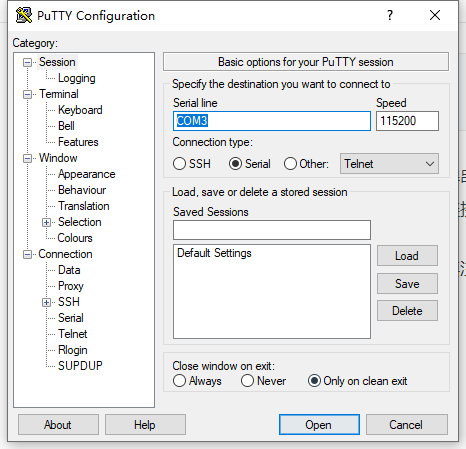

## 实战准备：如何搭建硬件开发环境

参考课程 https://time.geekbang.org/column/article/321652


连接NodeMCU：


下载驱动：
https://www.silabs.com/developers/usb-to-uart-bridge-vcp-drivers 


下载兼容ESP8266的MicroPython固件： https://micropython.org/download/esp8266/


安装python 2.7.15

```python
pip install esptool
```


```
.\esptool.py.exe --port COM3 erase_flash

.\esptool.py.exe --port COM3 --baud 460800 write_flash --flash_size=detect 0 esp8266-20220117-v1.18.bin

python pyboard.py --device COM3 -f cp main.py :

```

可以看到如下名称的wifi热点：


使用putty连接:




## 附件

WoT.City 的 Web of Things Framework 就是依靠不同 IoT 类型

| IoT Node (Device Type)      | Solution Platform                            | IoT Diagram (Use Scenario)                           |
| :-------------------------- | :------------------------------------------- | :--------------------------------------------------- |
| Single Board Computer (SBC) | Intel Edison、Qualcomm Dragonboard 410c etc. | IoT Router etc.                                      |
| High Performance MCU        | ARM mbed OS、Neuclio                         | Sensor hub (Time-series Data Type) etc.              |
| WiFi MCU                    | ESP8266、NodeMCU、EMW3165 etc.               | Sensor hub (Interrupt Type)、Network controller etc. |

NodeMCU 开发板 = ESP8266 模组 + USB to serial 芯片 + NodeMCU firmware


