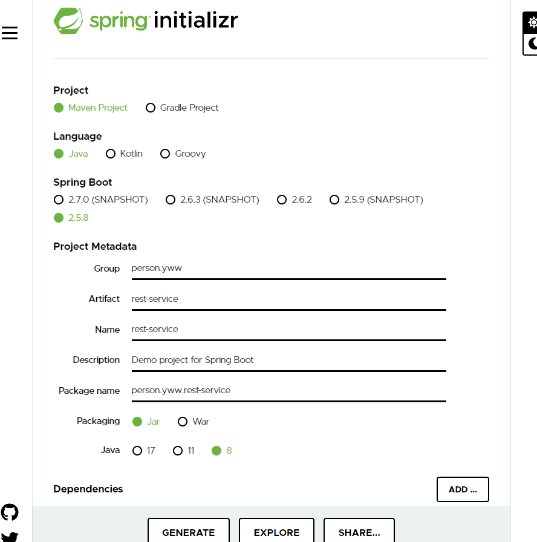
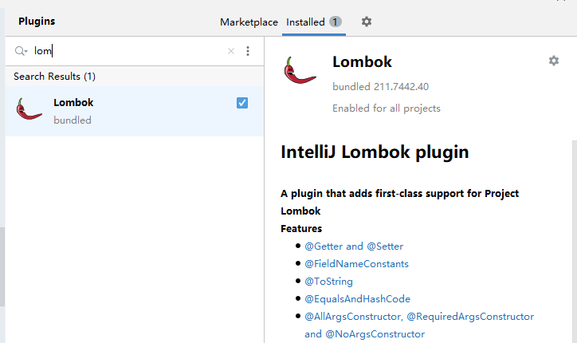

## 15MIN

https://start.spring.io/




示例：MVC

### M

```java
package person.yww.restservice;

import lombok.Data;

@Data
public class Greeting {
    private final long id;
    private final String content;
}
```

### C

```java
package person.yww.restservice;

import org.springframework.web.bind.annotation.GetMapping;
import org.springframework.web.bind.annotation.RequestParam;
import org.springframework.web.bind.annotation.RestController;

import java.util.concurrent.atomic.AtomicLong;

// Jackson 2 is on the classpath of spring-boot default
@RestController
public class GreetingController {
    private static final String template="Hello, %s!";
    private final AtomicLong counter=new AtomicLong();

    @GetMapping("/greeting")
    public Greeting greeting(
            @RequestParam(value = "name",defaultValue = "world")
             String name
    ){
        return new Greeting(counter.incrementAndGet(),String.format(template,name));
    }
}
```


> 跟其他的spring程序不太一样，暂时不需要xml配置?

Run:


## Lombok

pom.xml

```xml
<dependency>
    <groupId>org.projectlombok</groupId>
    <artifactId>lombok</artifactId>
    <optional>true</optional>
</dependency>

<build>
    <plugins>
        <plugin>
            <groupId>org.springframework.boot</groupId>
            <artifactId>spring-boot-maven-plugin</artifactId>
            <configuration>
                <excludes>
                    <exclude>
                        <groupId>org.projectlombok</groupId>
                        <artifactId>lombok</artifactId>
                    </exclude>
                </excludes>
            </configuration>
        </plugin>
    </plugins>
</build>
```

IDEA2021中已经集成lombok




| --                                                           | --         | --                                                           |
| ------------------------------------------------------------ | ---------- | ------------------------------------------------------------ |
| @Getter @Setter                                              | 变量和类   | 自动生成get/set方法                                          |
| @ToString                                                    | 类         | 自动生成tostring                                             |
| @EqualsAndHashCode                                           | 类         | equals和hashcode                                             |
| @NonNull                                                     | 变量和参数 | 非空判断                                                     |
| @NoArgsConstructor<br />@RequiredArgsConstructor  (finnal和nonull) <br />@AllArgsConstructor | 类         | 生成构造函数                                                 |
| @Data                                                        | 类         | @Tostring+@EqualsAndHashcode+<br />@Getter+@Setter+@RequiredArgsConstrcutor<br />注：有点类似scala的case class |
| @Builder                                                     | 类         | 建造者模式                                                   |
| @Log                                                         | 类         | 日志                                                         |
| @Cleanup                                                     |            | 自动关闭资源。对java.io.Closeable接口有效                    |
| @SneakyThrows                                                | 方法       | 对受检异常进行捕捉并抛出                                     |
| @Synchronized                                                | 方法       | 替换synchronize或lock                                        |


## MySQL

配置application.properties，否则mysql默认使用`H2`

```properties
spring.jpa.hibernate.ddl-auto=update
spring.datasource.url=jdbc:mysql://${MYSQL_HOST:localhost}:3306/job
spring.datasource.username=root
spring.datasource.password=123456
spring.datasource.driver-class-name =com.mysql.jdbc.Driver
#spring.jpa.show-sql: true
```

其中jpa.hibernate可以设置成如下:

+ `none`:  `MySQL`默认.不改变数据表结构
+ `update`: 根据entity更新数据表结构.
+ `create`: 每次启动创建.
+ `create-drop`: 每次启动创建，关闭时删除.

创建entity

```java
package person.yww.oso;

import lombok.Data;

import javax.persistence.Entity;
import javax.persistence.GeneratedValue;
import javax.persistence.GenerationType;
import javax.persistence.Id;

@Entity
@Data
public class User {
    @Id
    @GeneratedValue(strategy = GenerationType.AUTO)
    private Integer id;

    private String name;
    private String email;
}
```

创建UserRepository

```java
package person.yww.oso;

import org.springframework.data.repository.CrudRepository;

// 派生自spring通用的CrudRepository
public interface UserRepository  extends CrudRepository<User,Integer> {
}
```

创建controller

```java
package person.yww.oso;

import org.springframework.beans.factory.annotation.Autowired;
import org.springframework.stereotype.Controller;
import org.springframework.web.bind.annotation.*;

@Controller
@RequestMapping(path = "/user")
public class UserController {
    @Autowired // 让spring自动生成bean
    private UserRepository userRepository;
    @PostMapping(path = "/add")
    public @ResponseBody String addUser(@RequestBody User user){
        // @ResponseBody  返回字符串是HTTP响应内容
        User u=new User();
        u.setName(user.getName());
        u.setEmail(user.getEmail());
        userRepository.save(u);
        return "Saved "+u.getId();
    }

    @GetMapping(path = "/all")
    public @ResponseBody Iterable<User> getUsers(){
        return userRepository.findAll();
    }
}
```


## Spring-Data-Rest

pom.xml

```xml
<dependency>
    <groupId>org.springframework.boot</groupId>
    <artifactId>spring-boot-starter-data-rest</artifactId>
</dependency>
```


创建模型

```java
package person.yww.react;

import lombok.Data;

import javax.persistence.Entity;
import javax.persistence.GeneratedValue;
import javax.persistence.Id;

@Data
@Entity
public class Employee {
    private @Id @GeneratedValue Long id;
    private String firstName;
    private String lastName;
    private String description;

    public Employee(){
    }

    public Employee(String fn,String ln,String desc){
        this.firstName=fn;
        this.lastName=ln;
        this.description=desc;
    }
}
```

```java
package person.yww.react;

import org.springframework.data.repository.CrudRepository;

public interface EmployeeRepository extends CrudRepository<Employee,Long> {
}
```


 预加载数据

```java
// 预加载数据
@Component // 自动注入
public class DatabaseLoader implements CommandLineRunner {
    private final EmployeeRepository repository;

    @Autowired // 自动封装repository
    public DatabaseLoader(EmployeeRepository repository){
        this.repository=repository;
    }
    @Override // 继承CommandLineRunner 启动时运行
    public void run(String... args) throws Exception {
        this.repository.save(new Employee("yin","ww","ceo"));
    }
}
```

修改默认根路由地址

```properties
spring.data.rest.base-path=/api
```


访问：(同样可以执行POST DELETE等操作)

```shell
C:\Users\Administrator>curl http://localhost:8080/api/employees/4
{
  "firstName" : "yin",
  "lastName" : "ww",
  "description" : "ceo",
  "_links" : {
    "self" : {
      "href" : "http://localhost:8080/api/employees/4"
    },
    "employee" : {
      "href" : "http://localhost:8080/api/employees/4"
    }
  }
}
```


## JPA

REFER https://blog.csdn.net/qq_42495847/article/details/107991361

全英文名叫`Java Persistence API`，就是java持久化[api](https://so.csdn.net/so/search?q=api&spm=1001.2101.3001.7020)，是SUN公司推出的一套基于`ORM`的规范;

Spring-Data-JPA则是在JPA之上添加另一层抽象（Repository层的实现）；


- 标准的MVC结构，有助于解耦的实现；
- 实体类放在 `pojo/entity` 下
- dao（数据访问对象 data access object）在JPA中叫做`repository`，请遵守这个规范，就像mybaits的dao叫`mapper`一样。

> @Resource和@Autowired注解都是用来实现依赖注入的。只是@Autowired按by type自动注入，而@Resource默认按by name自动注入


> 连接postgresql jpa需要设置hibernate方言类型：
>
> ```
> spring.jpa.properties.hibernate.dialect=org.hibernate.dialect.PostgreSQL10Dialect
> ```

> 不支援 10 验证类型。请核对您已经组态 pg_hba.conf 文件包含客户端的IP位址或网
>
> 解决：更新postgresql jar到最新

> Circular view path
>
> 解决：@Controller` → `@RestController


